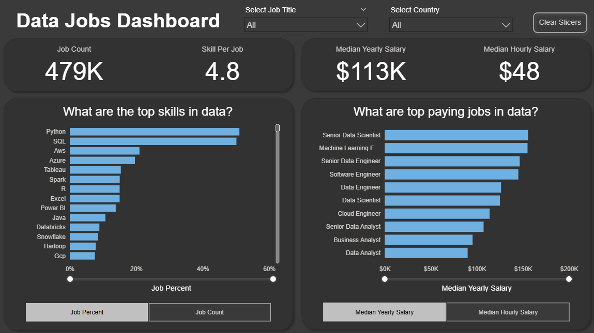

# Power BI Dashboard: Job Market Insights

## Table of Contents
- [Introduction](#introduction)  
- [Dashboard File](#dashboard-file)  
- [Skills Demonstrated](#skills-demonstrated)  
- [Dashboard Overview](#dashboard-overview)  
- [Conclusion](#conclusion)  

## Introduction

The data job market is often fragmented, with details scattered across many sources. This dashboard is designed for **job seekers, career changers, and professionals exploring new opportunities**. It leverages a 2024 dataset of data science job postings—including roles, salaries, and locations—to deliver a concise, single-page view of market trends and compensation insights.

### Dashboard File
Download the dashboard file here: [Power_BI_Dashboard_Job_Market_Insights.pbix](Power_BI_Dashboard_Job_Market_Insights.pbix)  

## Skills Demonstrated

This project highlights practical use of Power BI features:

* **Dashboard Design:** Developing an intuitive and visually structured layout.  
* **Power Query (ETL):** Cleaning, shaping, and transforming raw data.  
* **Data Modeling:** Applying star schema principles to build efficient models and relationships.  
* **DAX:** Writing measures and calculations to extract insights.  
* **Visualizations:**  
  * Core charts: column, bar, line, and area  
  * Maps: geospatial analysis  
  * Cards: key metrics and KPIs  
  * Tables: detailed tabular views  
* **Interactivity:**  
  * Slicers for dynamic filtering  
  * Buttons and bookmarks for navigation and drill-through  

## Dashboard Overview

This single-page dashboard gives job seekers quick access to the most important market trends.

It highlights key performance indicators (KPIs) such as **Job Count, Skills per Job, Median Yearly Salary, and Median Hourly Salary**. It also shows **Skill Popularity** (by percentage or count) and compares **salaries across job titles**, creating an efficient snapshot of the data job market.

## Conclusion

This dashboard demonstrates how Power BI can transform large volumes of job posting data into a clear and practical career analysis tool. It enables **job seekers, career changers, and professionals exploring new roles** to filter and explore market insights on a single page, supporting informed career decisions.

